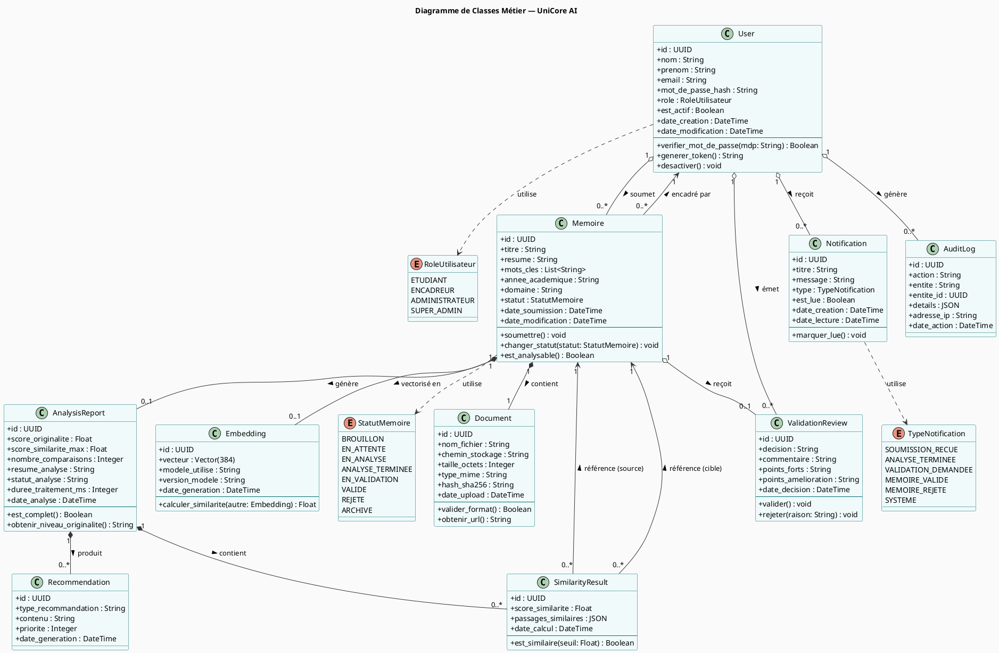
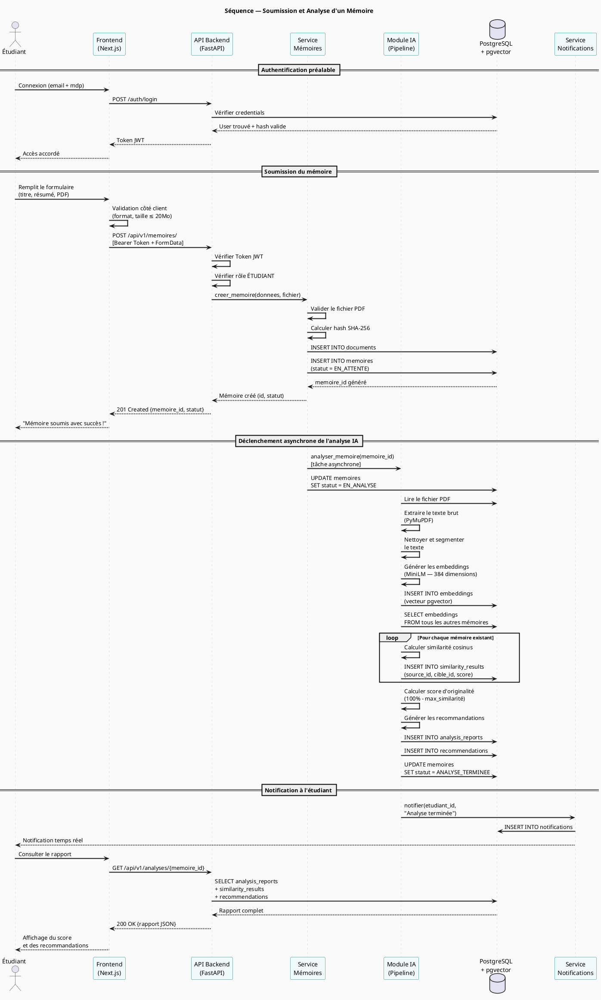
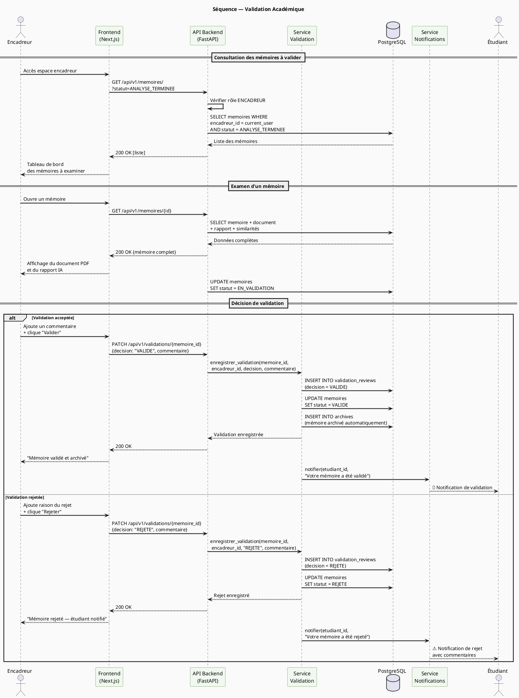
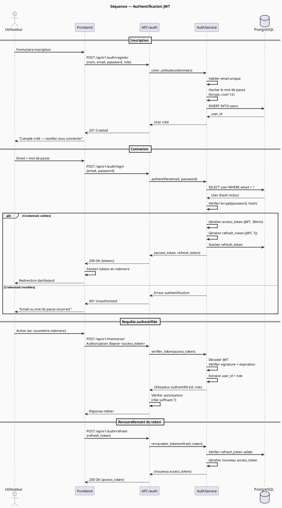

# Phase 1 — Conception UML — UniCore AI

## Introduction

Ce document présente la conception fonctionnelle et technique de la plateforme UniCore AI à travers les diagrammes UML fondamentaux. Ces artefacts constituent la référence de conception pour toutes les phases de développement suivantes.

---

## 1. Diagramme de Cas d'Utilisation

### 1.1 Acteurs du système

| Acteur | Type | Description |
|---|---|---|
| **Étudiant** | Primaire | Soumet ses mémoires et consulte les résultats d'analyse |
| **Encadreur** | Primaire | Examine, commente et valide les mémoires |
| **Administrateur** | Primaire | Gère les utilisateurs et supervise la plateforme |
| **Super Administrateur** | Primaire | Accès total, configuration système |
| **Système IA** | Secondaire | Déclenche l'analyse automatique des documents |

### 1.2 Diagramme — Vue PlantUML

```plantuml
@startuml UniCore_AI_Use_Cases

skinparam actorStyle awesome
skinparam packageStyle rectangle
skinparam backgroundColor #FAFAFA
skinparam ArrowColor #333333
skinparam ActorBorderColor #01696f
skinparam UsecaseBorderColor #01696f
skinparam UsecaseBackgroundColor #e8f4f5

title Diagramme de Cas d'Utilisation — UniCore AI

' ==================== ACTEURS ====================
actor "Étudiant" as ETU #01696f
actor "Encadreur" as ENC #437a22
actor "Administrateur" as ADM #da7101
actor "Super Admin" as SPA #a12c7b
actor "Système IA" as SIA #006494

' ==================== SYSTÈME ====================
rectangle "UniCore AI — Plateforme Académique" {

  ' --- Authentification (tous) ---
  package "Authentification" {
    usecase "S'inscrire" as UC01
    usecase "Se connecter" as UC02
    usecase "Réinitialiser le mot de passe" as UC03
    usecase "Gérer son profil" as UC04
  }

  ' --- Espace Étudiant ---
  package "Gestion des Mémoires" {
    usecase "Soumettre un mémoire (PDF)" as UC05
    usecase "Consulter ses soumissions" as UC06
    usecase "Consulter le rapport d'analyse" as UC07
    usecase "Consulter le score d'originalité" as UC08
    usecase "Lire les recommandations" as UC09
    usecase "Suivre le statut de validation" as UC10
  }

  ' --- Module IA ---
  package "Analyse Intelligente" {
    usecase "Extraire le texte du PDF" as UC11
    usecase "Générer les embeddings" as UC12
    usecase "Calculer la similarité cosinus" as UC13
    usecase "Calculer le score d'originalité" as UC14
    usecase "Générer les recommandations" as UC15
  }

  ' --- Espace Encadreur ---
  package "Validation Académique" {
    usecase "Consulter les mémoires à valider" as UC16
    usecase "Lire le rapport d'analyse IA" as UC17
    usecase "Ajouter un commentaire" as UC18
    usecase "Valider un mémoire" as UC19
    usecase "Rejeter un mémoire" as UC20
    usecase "Archiver un mémoire validé" as UC21
  }

  ' --- Espace Admin ---
  package "Administration" {
    usecase "Gérer les utilisateurs" as UC22
    usecase "Consulter les statistiques globales" as UC23
    usecase "Gérer les établissements" as UC24
    usecase "Configurer le système" as UC25
    usecase "Superviser toute la plateforme" as UC26
  }

  ' --- Notifications ---
  package "Notifications" {
    usecase "Recevoir une notification" as UC27
    usecase "Envoyer une notification" as UC28
  }
}

' ==================== RELATIONS ACTEURS ====================

' Étudiant
ETU --> UC01
ETU --> UC02
ETU --> UC03
ETU --> UC04
ETU --> UC05
ETU --> UC06
ETU --> UC07
ETU --> UC08
ETU --> UC09
ETU --> UC10
ETU --> UC27

' Encadreur
ENC --> UC02
ENC --> UC04
ENC --> UC16
ENC --> UC17
ENC --> UC18
ENC --> UC19
ENC --> UC20
ENC --> UC21
ENC --> UC27

' Administrateur
ADM --> UC02
ADM --> UC04
ADM --> UC22
ADM --> UC23
ADM --> UC24
ADM --> UC27

' Super Admin
SPA --> UC25
SPA --> UC26
SPA --> UC22
SPA --> UC02

' Système IA (déclenché automatiquement)
SIA --> UC11
SIA --> UC12
SIA --> UC13
SIA --> UC14
SIA --> UC15
SIA --> UC28

' ==================== RELATIONS INCLUDE / EXTEND ====================

' La soumission inclut toujours le déclenchement de l'analyse IA
UC05 .> UC11 : <<include>>
UC11 .> UC12 : <<include>>
UC12 .> UC13 : <<include>>
UC13 .> UC14 : <<include>>
UC14 .> UC15 : <<include>>

' Consulter le rapport inclut le score et les recommandations
UC07 .> UC08 : <<include>>
UC07 .> UC09 : <<include>>

' La validation peut déclencher l'archivage
UC19 .> UC21 : <<extend>>

' Toute action importante génère une notification
UC05 .> UC28 : <<extend>>
UC19 .> UC28 : <<extend>>
UC20 .> UC28 : <<extend>>

@enduml
```

### 1.3 Description textuelle des cas d'utilisation principaux

#### UC05 — Soumettre un mémoire

| Élément | Détail |
|---|---|
| **Acteur principal** | Étudiant |
| **Précondition** | L'étudiant est authentifié |
| **Déclencheur** | L'étudiant clique sur "Déposer mon mémoire" |
| **Scénario nominal** | 1. L'étudiant remplit le formulaire (titre, résumé, fichier PDF) → 2. Le système valide le fichier → 3. Le document est enregistré → 4. L'analyse IA est déclenchée automatiquement → 5. Une notification est envoyée |
| **Scénarios alternatifs** | Fichier non PDF → message d'erreur / Taille dépassée → rejet |
| **Postcondition** | Le mémoire est enregistré avec le statut `EN_ATTENTE` |

#### UC19 — Valider un mémoire

| Élément | Détail |
|---|---|
| **Acteur principal** | Encadreur |
| **Précondition** | L'encadreur est authentifié / le rapport d'analyse est disponible |
| **Déclencheur** | L'encadreur ouvre un mémoire à valider |
| **Scénario nominal** | 1. L'encadreur consulte le rapport IA → 2. Il lit le document → 3. Il ajoute un commentaire (optionnel) → 4. Il clique sur "Valider" → 5. Le mémoire passe au statut `VALIDÉ` → 6. Le mémoire est archivé automatiquement → 7. L'étudiant est notifié |
| **Scénarios alternatifs** | Rejet → statut `REJETÉ`, retour à l'étudiant avec commentaires |
| **Postcondition** | Le mémoire est archivé ou retourné à l'étudiant |

---

## 2. Diagramme de Classes

### 2.1 Concept

Le diagramme de classes modélise les entités métier du système, leurs attributs et leurs relations. Chaque classe correspond à une table de base de données et à un modèle SQLAlchemy.

### 2.2 Diagramme — Vue PlantUML

---

## 3. Diagrammes de Séquence

### 3.1 Séquence 1 — Soumission et analyse d'un mémoire

Ce diagramme modélise le flux complet depuis le dépôt d'un mémoire jusqu'à la disponibilité du rapport d'analyse.

### 3.2 Séquence 2 — Validation académique par l'encadreur

### 3.3 Séquence 3 — Authentification JWT

---

## Récapitulatif des artefacts UML

| Diagramme | Fichier | Usage |
|---|---|---|
| Cas d'utilisation | Ce document, section 1 | Définir le périmètre fonctionnel |
| Classes métier | Ce document, section 2 | Base pour SQLAlchemy et Pydantic |
| Séquence — Soumission/Analyse | Ce document, section 3.1 | Guide l'implémentation du pipeline IA |
| Séquence — Validation | Ce document, section 3.2 | Guide l'implémentation du workflow métier |
| Séquence — Auth JWT | Ce document, section 3.3 | Guide l'implémentation de la sécurité |

> Ces diagrammes utilisent la notation **PlantUML**. Ils peuvent être rendus avec [PlantUML Online](https://www.plantuml.com/plantuml/uml/) ou l'extension VS Code **PlantUML**.
