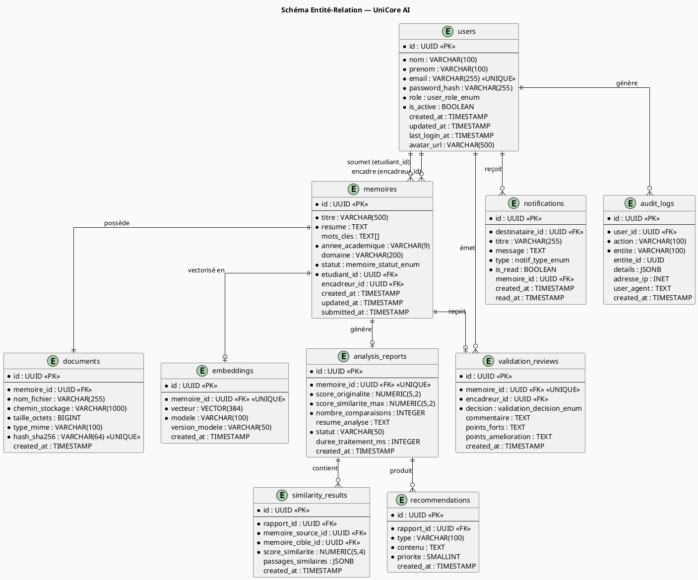

# Phase 1 — Schéma de Base de Données — UniCore AI

## Introduction

Ce document présente le schéma relationnel complet de la base de données PostgreSQL d'UniCore AI. Chaque table est expliquée avec ses colonnes, ses contraintes, ses index et la justification des choix de conception.

L'extension **pgvector** est utilisée pour stocker les représentations vectorielles (embeddings) des mémoires et permettre la recherche sémantique par similarité cosinus.

---

## 1. Principes de conception

| Principe | Application |
|---|---|
| **Identifiants UUID** | Toutes les tables utilisent `UUID` comme clé primaire pour éviter les collisions et faciliter les migrations |
| **Timestamps systématiques** | Chaque table a `created_at` et `updated_at` pour la traçabilité |
| **Soft delete** | Les enregistrements critiques ne sont jamais supprimés physiquement (`is_active`, `deleted_at`) |
| **Index stratégiques** | Index sur les colonnes de recherche fréquente (email, statut, foreign keys) |
| **Contraintes d'intégrité** | Clés étrangères avec comportement `ON DELETE` explicite |
| **Audit systématique** | Table `audit_logs` pour tracer toutes les actions sensibles |

---

## 2. Schéma ERD — Vue PlantUML



---

## 3. Scripts SQL de création

### 3.1 Extensions et types énumérés

```sql
-- ============================================
-- UNICORE AI — Initialisation base de données
-- ============================================

-- Extension vectorielle pour les embeddings sémantiques
CREATE EXTENSION IF NOT EXISTS "uuid-ossp";
CREATE EXTENSION IF NOT EXISTS "vector";

-- ============================================
-- TYPES ÉNUMÉRÉS
-- ============================================

-- Rôles utilisateurs
CREATE TYPE user_role_enum AS ENUM (
    'ETUDIANT',
    'ENCADREUR',
    'ADMINISTRATEUR',
    'SUPER_ADMIN'
);

-- Statuts du cycle de vie d'un mémoire
CREATE TYPE memoire_statut_enum AS ENUM (
    'BROUILLON',         -- Créé mais pas encore soumis
    'EN_ATTENTE',        -- Soumis, en attente d'analyse
    'EN_ANALYSE',        -- Analyse IA en cours
    'ANALYSE_TERMINEE',  -- Rapport disponible, en attente de validation
    'EN_VALIDATION',     -- L'encadreur est en train d'examiner
    'VALIDE',            -- Approuvé par l'encadreur
    'REJETE',            -- Rejeté par l'encadreur
    'ARCHIVE'            -- Archivé définitivement
);

-- Décision de validation
CREATE TYPE validation_decision_enum AS ENUM (
    'VALIDE',
    'REJETE',
    'REVISION_DEMANDEE'
);

-- Types de notifications
CREATE TYPE notif_type_enum AS ENUM (
    'SOUMISSION_RECUE',
    'ANALYSE_TERMINEE',
    'VALIDATION_DEMANDEE',
    'MEMOIRE_VALIDE',
    'MEMOIRE_REJETE',
    'REVISION_DEMANDEE',
    'SYSTEME'
);
```

### 3.2 Table `users`

```sql
-- ============================================
-- TABLE : users
-- Tous les utilisateurs de la plateforme
-- ============================================
CREATE TABLE users (
    id              UUID PRIMARY KEY DEFAULT uuid_generate_v4(),
    nom             VARCHAR(100) NOT NULL,
    prenom          VARCHAR(100) NOT NULL,
    email           VARCHAR(255) NOT NULL UNIQUE,
    password_hash   VARCHAR(255) NOT NULL,
    role            user_role_enum NOT NULL DEFAULT 'ETUDIANT',
    is_active       BOOLEAN NOT NULL DEFAULT TRUE,
    avatar_url      VARCHAR(500),
    last_login_at   TIMESTAMP WITH TIME ZONE,
    created_at      TIMESTAMP WITH TIME ZONE NOT NULL DEFAULT NOW(),
    updated_at      TIMESTAMP WITH TIME ZONE NOT NULL DEFAULT NOW()
);

-- Index sur l'email (recherche la plus fréquente)
CREATE INDEX idx_users_email ON users(email);
-- Index sur le rôle (filtrage par type d'utilisateur)
CREATE INDEX idx_users_role ON users(role);
-- Index sur is_active (exclure les comptes désactivés)
CREATE INDEX idx_users_is_active ON users(is_active);

COMMENT ON TABLE users IS 'Tous les utilisateurs de la plateforme UniCore AI';
COMMENT ON COLUMN users.password_hash IS 'Mot de passe haché avec bcrypt (cost=12)';
COMMENT ON COLUMN users.role IS 'Rôle déterminant les permissions de l''utilisateur';
```

### 3.3 Table `memoires`

```sql
-- ============================================
-- TABLE : memoires
-- Les mémoires académiques soumis
-- ============================================
CREATE TABLE memoires (
    id                  UUID PRIMARY KEY DEFAULT uuid_generate_v4(),
    titre               VARCHAR(500) NOT NULL,
    resume              TEXT NOT NULL,
    mots_cles           TEXT[] DEFAULT '{}',
    annee_academique    VARCHAR(9) NOT NULL,        -- Ex: "2024-2025"
    domaine             VARCHAR(200),               -- Ex: "Informatique"
    statut              memoire_statut_enum NOT NULL DEFAULT 'EN_ATTENTE',
    etudiant_id         UUID NOT NULL REFERENCES users(id) ON DELETE RESTRICT,
    encadreur_id        UUID REFERENCES users(id) ON DELETE SET NULL,
    submitted_at        TIMESTAMP WITH TIME ZONE NOT NULL DEFAULT NOW(),
    created_at          TIMESTAMP WITH TIME ZONE NOT NULL DEFAULT NOW(),
    updated_at          TIMESTAMP WITH TIME ZONE NOT NULL DEFAULT NOW(),

    -- Contrainte : l'encadreur ne peut pas être l'étudiant
    CONSTRAINT chk_etudiant_ne_peut_encadrer
        CHECK (etudiant_id != encadreur_id)
);

CREATE INDEX idx_memoires_etudiant_id ON memoires(etudiant_id);
CREATE INDEX idx_memoires_encadreur_id ON memoires(encadreur_id);
CREATE INDEX idx_memoires_statut ON memoires(statut);
CREATE INDEX idx_memoires_annee ON memoires(annee_academique);
CREATE INDEX idx_memoires_mots_cles ON memoires USING GIN(mots_cles);

COMMENT ON TABLE memoires IS 'Mémoires académiques soumis par les étudiants';
COMMENT ON COLUMN memoires.statut IS 'Cycle de vie du mémoire depuis la soumission jusqu''à l''archivage';
```

### 3.4 Table `documents`

```sql
-- ============================================
-- TABLE : documents
-- Fichiers PDF associés aux mémoires
-- ============================================
CREATE TABLE documents (
    id              UUID PRIMARY KEY DEFAULT uuid_generate_v4(),
    memoire_id      UUID NOT NULL UNIQUE REFERENCES memoires(id) ON DELETE CASCADE,
    nom_fichier     VARCHAR(255) NOT NULL,
    chemin_stockage VARCHAR(1000) NOT NULL,
    taille_octets   BIGINT NOT NULL,
    type_mime       VARCHAR(100) NOT NULL DEFAULT 'application/pdf',
    hash_sha256     VARCHAR(64) NOT NULL UNIQUE,   -- Détection des doublons
    created_at      TIMESTAMP WITH TIME ZONE NOT NULL DEFAULT NOW()
);

CREATE INDEX idx_documents_memoire_id ON documents(memoire_id);
CREATE INDEX idx_documents_hash ON documents(hash_sha256);

COMMENT ON COLUMN documents.hash_sha256 IS 'Empreinte SHA-256 pour détecter les fichiers identiques';
```

### 3.5 Table `embeddings`

```sql
-- ============================================
-- TABLE : embeddings
-- Vecteurs sémantiques générés par MiniLM
-- Nécessite l'extension pgvector
-- ============================================
CREATE TABLE embeddings (
    id              UUID PRIMARY KEY DEFAULT uuid_generate_v4(),
    memoire_id      UUID NOT NULL UNIQUE REFERENCES memoires(id) ON DELETE CASCADE,
    vecteur         VECTOR(384) NOT NULL,           -- MiniLM produit 384 dimensions
    modele          VARCHAR(100) NOT NULL DEFAULT 'all-MiniLM-L6-v2',
    version_modele  VARCHAR(50),
    created_at      TIMESTAMP WITH TIME ZONE NOT NULL DEFAULT NOW()
);

-- Index HNSW pour la recherche vectorielle rapide (meilleure performance que IVFFlat)
CREATE INDEX idx_embeddings_vecteur_hnsw
    ON embeddings USING hnsw (vecteur vector_cosine_ops)
    WITH (m = 16, ef_construction = 64);

COMMENT ON TABLE embeddings IS 'Représentations vectorielles des mémoires pour la recherche sémantique';
COMMENT ON COLUMN embeddings.vecteur IS 'Vecteur de 384 dimensions généré par sentence-transformers/all-MiniLM-L6-v2';
```

### 3.6 Tables d'analyse

```sql
-- ============================================
-- TABLE : analysis_reports
-- Rapports d'analyse IA
-- ============================================
CREATE TABLE analysis_reports (
    id                      UUID PRIMARY KEY DEFAULT uuid_generate_v4(),
    memoire_id              UUID NOT NULL UNIQUE REFERENCES memoires(id) ON DELETE CASCADE,
    score_originalite       NUMERIC(5,2) NOT NULL              -- Ex: 87.45
        CHECK (score_originalite BETWEEN 0 AND 100),
    score_similarite_max    NUMERIC(5,4) NOT NULL              -- Ex: 0.1255
        CHECK (score_similarite_max BETWEEN 0 AND 1),
    nombre_comparaisons     INTEGER NOT NULL DEFAULT 0,
    resume_analyse          TEXT,
    statut                  VARCHAR(50) NOT NULL DEFAULT 'COMPLET',
    duree_traitement_ms     INTEGER,
    created_at              TIMESTAMP WITH TIME ZONE NOT NULL DEFAULT NOW()
);

-- ============================================
-- TABLE : similarity_results
-- Résultats de comparaison entre deux mémoires
-- ============================================
CREATE TABLE similarity_results (
    id                  UUID PRIMARY KEY DEFAULT uuid_generate_v4(),
    rapport_id          UUID NOT NULL REFERENCES analysis_reports(id) ON DELETE CASCADE,
    memoire_source_id   UUID NOT NULL REFERENCES memoires(id) ON DELETE CASCADE,
    memoire_cible_id    UUID NOT NULL REFERENCES memoires(id) ON DELETE CASCADE,
    score_similarite    NUMERIC(5,4) NOT NULL
        CHECK (score_similarite BETWEEN 0 AND 1),
    passages_similaires JSONB DEFAULT '[]',
    created_at          TIMESTAMP WITH TIME ZONE NOT NULL DEFAULT NOW(),

    -- Éviter les doublons de comparaison
    CONSTRAINT uq_similarity_pair
        UNIQUE (rapport_id, memoire_source_id, memoire_cible_id),

    -- Un mémoire ne peut pas être comparé à lui-même
    CONSTRAINT chk_no_self_comparison
        CHECK (memoire_source_id != memoire_cible_id)
);

CREATE INDEX idx_similarity_rapport_id ON similarity_results(rapport_id);
CREATE INDEX idx_similarity_score ON similarity_results(score_similarite DESC);

-- ============================================
-- TABLE : recommendations
-- Suggestions générées par le module IA
-- ============================================
CREATE TABLE recommendations (
    id          UUID PRIMARY KEY DEFAULT uuid_generate_v4(),
    rapport_id  UUID NOT NULL REFERENCES analysis_reports(id) ON DELETE CASCADE,
    type        VARCHAR(100) NOT NULL,     -- Ex: "ORIGINALITE", "STRUCTURE", "REFERENCES"
    contenu     TEXT NOT NULL,
    priorite    SMALLINT NOT NULL DEFAULT 1
        CHECK (priorite BETWEEN 1 AND 5),
    created_at  TIMESTAMP WITH TIME ZONE NOT NULL DEFAULT NOW()
);

CREATE INDEX idx_recommendations_rapport_id ON recommendations(rapport_id);
CREATE INDEX idx_recommendations_priorite ON recommendations(priorite);
```

### 3.7 Tables de validation et traçabilité

```sql
-- ============================================
-- TABLE : validation_reviews
-- Décisions des encadreurs
-- ============================================
CREATE TABLE validation_reviews (
    id                      UUID PRIMARY KEY DEFAULT uuid_generate_v4(),
    memoire_id              UUID NOT NULL UNIQUE REFERENCES memoires(id) ON DELETE CASCADE,
    encadreur_id            UUID NOT NULL REFERENCES users(id) ON DELETE RESTRICT,
    decision                validation_decision_enum NOT NULL,
    commentaire             TEXT,
    points_forts            TEXT,
    points_amelioration     TEXT,
    created_at              TIMESTAMP WITH TIME ZONE NOT NULL DEFAULT NOW()
);

CREATE INDEX idx_validations_memoire_id ON validation_reviews(memoire_id);
CREATE INDEX idx_validations_encadreur_id ON validation_reviews(encadreur_id);
CREATE INDEX idx_validations_decision ON validation_reviews(decision);

-- ============================================
-- TABLE : notifications
-- Messages système aux utilisateurs
-- ============================================
CREATE TABLE notifications (
    id              UUID PRIMARY KEY DEFAULT uuid_generate_v4(),
    destinataire_id UUID NOT NULL REFERENCES users(id) ON DELETE CASCADE,
    titre           VARCHAR(255) NOT NULL,
    message         TEXT NOT NULL,
    type            notif_type_enum NOT NULL,
    is_read         BOOLEAN NOT NULL DEFAULT FALSE,
    memoire_id      UUID REFERENCES memoires(id) ON DELETE SET NULL,
    created_at      TIMESTAMP WITH TIME ZONE NOT NULL DEFAULT NOW(),
    read_at         TIMESTAMP WITH TIME ZONE
);

CREATE INDEX idx_notifications_destinataire ON notifications(destinataire_id);
CREATE INDEX idx_notifications_is_read ON notifications(destinataire_id, is_read);

-- ============================================
-- TABLE : audit_logs
-- Journal de toutes les actions sensibles
-- ============================================
CREATE TABLE audit_logs (
    id          UUID PRIMARY KEY DEFAULT uuid_generate_v4(),
    user_id     UUID REFERENCES users(id) ON DELETE SET NULL,
    action      VARCHAR(100) NOT NULL,   -- Ex: "LOGIN", "SUBMIT_MEMOIRE", "VALIDATE"
    entite      VARCHAR(100),            -- Ex: "memoires", "users"
    entite_id   UUID,
    details     JSONB DEFAULT '{}',
    adresse_ip  INET,
    user_agent  TEXT,
    created_at  TIMESTAMP WITH TIME ZONE NOT NULL DEFAULT NOW()
);

CREATE INDEX idx_audit_user_id ON audit_logs(user_id);
CREATE INDEX idx_audit_action ON audit_logs(action);
CREATE INDEX idx_audit_created_at ON audit_logs(created_at DESC);
```

### 3.8 Trigger de mise à jour automatique

```sql
-- ============================================
-- TRIGGER : updated_at automatique
-- ============================================
CREATE OR REPLACE FUNCTION update_updated_at_column()
RETURNS TRIGGER AS $$
BEGIN
    NEW.updated_at = NOW();
    RETURN NEW;
END;
$$ LANGUAGE plpgsql;

-- Appliquer le trigger sur les tables qui ont updated_at
CREATE TRIGGER trg_users_updated_at
    BEFORE UPDATE ON users
    FOR EACH ROW EXECUTE FUNCTION update_updated_at_column();

CREATE TRIGGER trg_memoires_updated_at
    BEFORE UPDATE ON memoires
    FOR EACH ROW EXECUTE FUNCTION update_updated_at_column();
```

---

## 4. Récapitulatif des tables

| Table | Lignes estimées | Clé primaire | Particularité |
|---|---|---|---|
| `users` | Milliers | UUID | Index email unique |
| `memoires` | Dizaines de milliers | UUID | Enum statut, tableau mots-clés |
| `documents` | 1 par mémoire | UUID | Hash SHA-256 anti-doublon |
| `embeddings` | 1 par mémoire | UUID | **VECTOR(384)** pgvector + index HNSW |
| `analysis_reports` | 1 par mémoire | UUID | Score avec contrainte 0-100 |
| `similarity_results` | N par rapport | UUID | Contrainte anti-doublons |
| `recommendations` | N par rapport | UUID | Priorité 1-5 |
| `validation_reviews` | 1 par mémoire | UUID | Enum décision |
| `notifications` | Nombreuses | UUID | Index composite destinataire+lu |
| `audit_logs` | Très nombreuses | UUID | Partitionnement futur conseillé |

---

## 5. Requête de recherche vectorielle

Exemple de requête pour trouver les 5 mémoires les plus proches sémantiquement d'un mémoire donné :

```sql
-- Recherche des mémoires les plus similaires sémantiquement
-- en utilisant la distance cosinus (pgvector)
SELECT
    m.id,
    m.titre,
    m.annee_academique,
    u.nom || ' ' || u.prenom AS auteur,
    1 - (e.vecteur <=> (
        SELECT vecteur FROM embeddings WHERE memoire_id = $1
    )) AS score_similarite
FROM
    embeddings e
    JOIN memoires m ON m.id = e.memoire_id
    JOIN users u ON u.id = m.etudiant_id
WHERE
    e.memoire_id != $1          -- Exclure le mémoire lui-même
    AND m.statut = 'ARCHIVE'    -- Comparer uniquement avec les mémoires validés
ORDER BY
    e.vecteur <=> (SELECT vecteur FROM embeddings WHERE memoire_id = $1)
LIMIT 5;

-- Note : <=> est l'opérateur de distance cosinus de pgvector
-- score_similarite = 1 - distance cosinus
```
